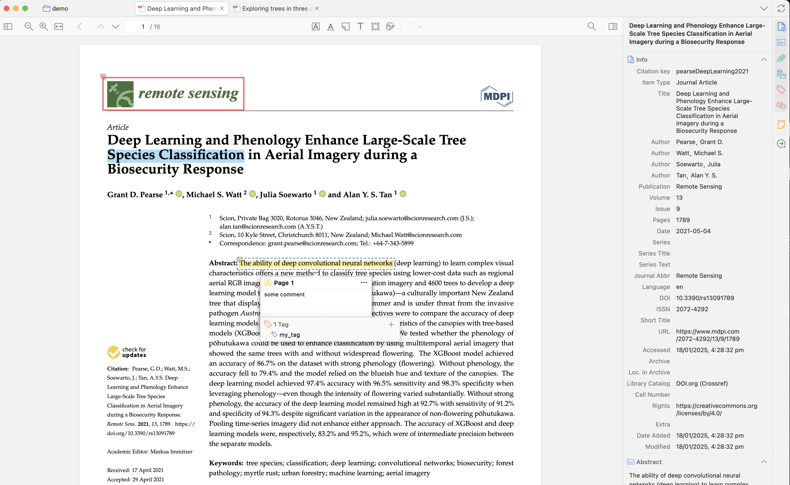
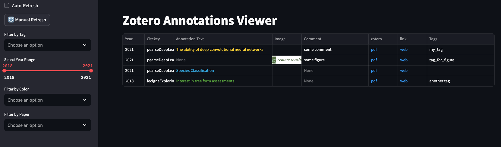
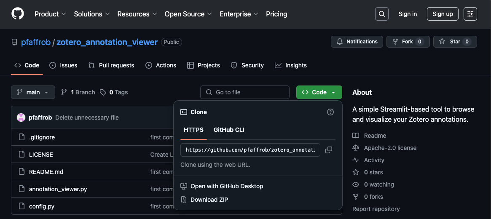

# Zotero Annotation Viewer

A simple Streamlit-based tool to browse and visualize your Zotero annotations.

Please be aware that this is far from perfect and there are many improvements that could be made. Especially when it comes to error handling. But please feel free to open an issue or a pull request if you have suggestions for improvements.


## 📖 Overview

This tool allows you to:
- View and filter annotations from a specific Zotero collection.
- Navigate through the annotations and their corresponding PDFs.
- Filter annotations based on:
  - Tags
  - Highlight color
  - Reference year
  - Paper

So it converts this:


Into this (automatically opens in your browser):


## 🛠️ Setup Instructions

Follow these steps to get started:

### 1. Download this repository
Clone this repository to your local machine.


```bash
cd path to your desired directory #(e.g. ~/Desktop)
git clone https://github.com/pfaffrob/zotero-annotation-viewer.git #this creates a folder called zotero-annotation-viewer
```
Alternatively download as a zip file and extract it:


### 2. Install Zotero  
Download and install Zotero from:  
https://www.zotero.org/download/

### 3. Install the Better BibTeX plugin  
Download and install Better BibTeX plugin for Zotero. More information can be found here:  
https://retorque.re/zotero-better-bibtex/

### 4. Install Anaconda or Miniconda (if not already installed)
Download from:  
https://docs.conda.io/en/latest/miniconda.html

### 5. Create a conda environment (or install packages in an existing environment)

```bash
conda create -n zotero_viewer python=3.11
```

### 6. Activate the environment

```bash
conda activate zotero_viewer
```

### 7. Install dependencies

```bash
conda install -c conda-forge streamlit=1.45.1 pandas=2.2.2 tc06580::pymupdf
pip install streamlit-autorefresh==1.0.1 PyMuPDF
```

### 8. Run the Streamlit app
Make sure that you use exactly the same collection name as specified within Zotero. 
Note that the collection name is case-sensitive and cannot contain spaces.

```bash
streamlit run annotation_viewer.py
```

